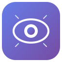
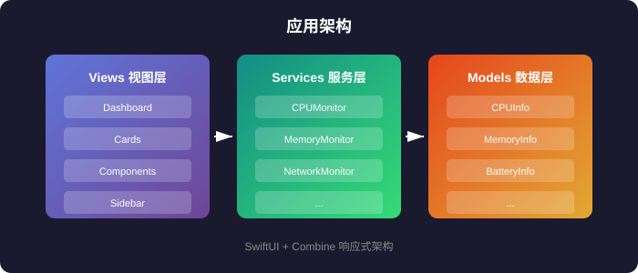
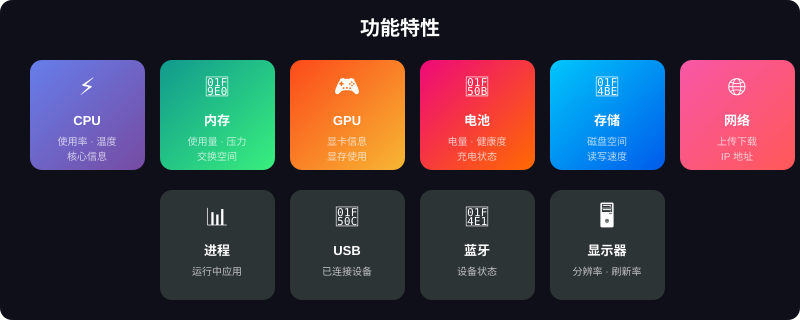
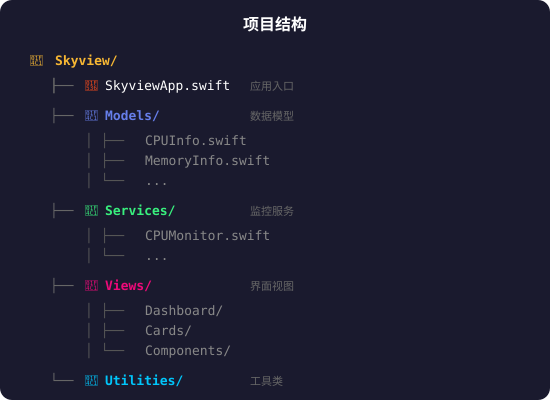
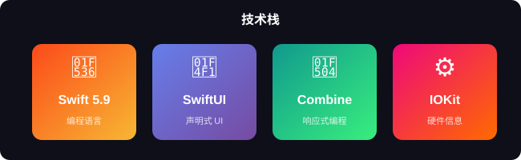
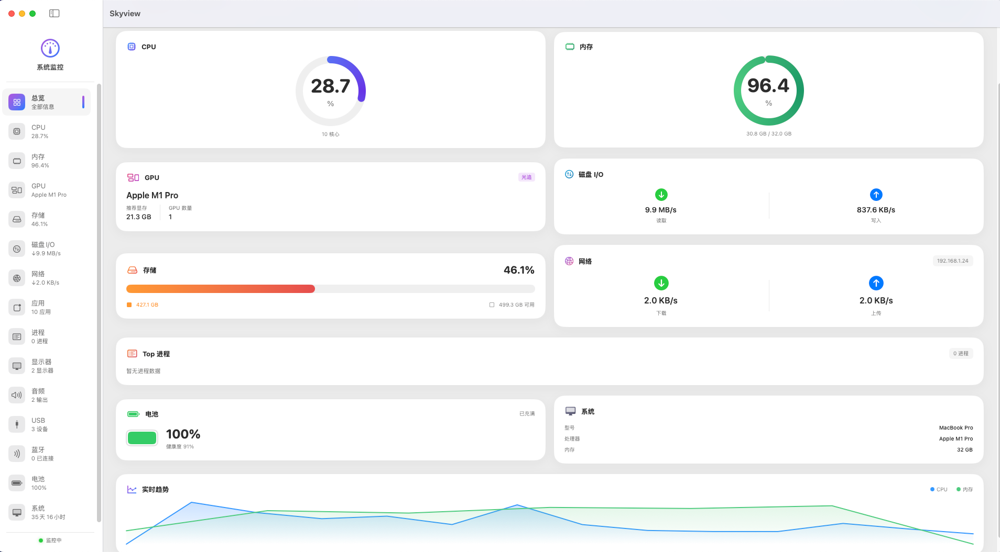

# Skyview

<p align="center">
  
</p>

<p align="center">
  <strong>macOS 系统信息监控工具</strong>
</p>

<p align="center">
  
  
  
  
  <a href="https://github.com/XZL-CODE/Skyview/actions/workflows/ci.yml"></a>
</p>

---

## 简介

Skyview 是一款轻量级的 macOS 系统监控应用，使用 SwiftUI 原生开发，帮助你实时了解 Mac 的运行状态。

<p align="center">
  
</p>

---

## 功能特性

<table>
<tr>
<td width="50%">

### 硬件监控

- **CPU** - 使用率、温度（SMC 实测）、核心信息
- **内存** - 使用量（与活动监视器同口径）、内存组成
- **GPU** - 显卡信息、Metal 能力
- **电池** - 电量、健康度、充电状态
- **存储** - 磁盘空间、读写速度

</td>
<td width="50%">

### 系统信息

- **网络** - 上传下载速度、IP 地址
- **进程** - 运行中的应用和进程
- **USB 设备** - 已连接的 USB 设备
- **蓝牙** - 蓝牙设备状态
- **显示器** - 分辨率、刷新率

</td>
</tr>
<tr>
<td width="50%">

### 常驻与提醒

- **菜单栏模式** - 菜单栏实时显示 CPU/内存，点击查看速览面板
- **阈值告警** - CPU 持续过高、内存压力大、磁盘空间不足时系统通知
- **后台降频** - 窗口非活跃时自动降低采集频率，省电

</td>
<td width="50%">

### 体验

- **设置页** - 开机自启、菜单栏内容、告警阈值均可配置
- **中英双语** - 跟随系统语言自动切换
- **后台采集** - 数据采集全部在后台线程，UI 零卡顿

</td>
</tr>
</table>

<p align="center">
  
</p>

---

## 系统要求

| 要求 | 最低版本 |
|------|---------|
| macOS | 13.0 (Ventura) |
| Xcode | 15.0 |
| Swift | 5.9 |

---

## 安装

### 方式一：下载安装

从 [Releases](https://github.com/XZL-CODE/Skyview/releases) 页面下载最新的 `.zip` 文件，解压后双击 `Skyview.app` 即可运行。

### 方式二：源码编译

```bash
# 克隆仓库
git clone https://github.com/XZL-CODE/Skyview.git

# 打开项目
cd Skyview
open Skyview.xcodeproj

# 在 Xcode 中按 Cmd+R 运行
```

---

## 项目结构

```
Skyview/
├── SkyviewApp.swift          # 应用入口（主窗口 + 菜单栏 + 设置三个 Scene）
├── Models/                   # 数据模型
├── Services/                 # 系统监控服务
│   ├── MetricsCollector.swift     # 后台采集调度（单心跳分频）
│   ├── SMCTemperatureReader.swift # SMC 温度读取
│   ├── AlertService.swift         # 阈值告警
│   ├── CPUMonitor.swift
│   └── ...
├── Views/                    # 界面视图
│   ├── Dashboard/           # 仪表盘
│   ├── Cards/               # 信息卡片
│   ├── Detail/              # 详情页
│   ├── MenuBar/             # 菜单栏面板
│   ├── Settings/            # 设置页
│   ├── Sidebar/             # 侧边栏
│   └── Components/          # 通用组件
├── Utilities/               # 工具类
└── Localizable.xcstrings    # 中英双语 String Catalog

SkyviewTests/                # 单元测试
.github/workflows/ci.yml     # CI（构建 + 测试）
```

<p align="center">
  
</p>

---

## 技术栈

<p align="center">
  
</p>

- **SwiftUI** - 声明式 UI 框架
- **Combine** - 响应式数据流
- **IOKit** - 硬件信息读取
- **SystemConfiguration** - 网络状态监控

---

## 截图

<p align="center">
  
</p>

---

## 贡献

欢迎提交 Issue 和 Pull Request！

1. Fork 本仓库
2. 创建特性分支 (`git checkout -b feature/AmazingFeature`)
3. 提交更改 (`git commit -m 'Add some AmazingFeature'`)
4. 推送到分支 (`git push origin feature/AmazingFeature`)
5. 创建 Pull Request

---

## 许可证

本项目采用 MIT 许可证 - 详见 [LICENSE](LICENSE) 文件。

---

## 作者

**xzl** - [GitHub](https://github.com/XZL-CODE) · [CSDN](https://blog.csdn.net/qq_60735796)

---

<p align="center">
  <sub>使用 ❤️ 和 SwiftUI 构建</sub>
</p>
